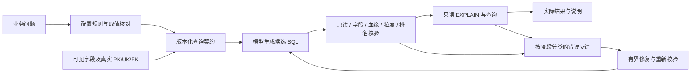

# 统一查询契约与分阶段校验

业务问数失败不能只按报错文字逐条修补。字段猜测、名称与枚举不一致、聚合粒度错误、排名阶段错误和校验误拒，是不同环节缺少共同约束造成的问题。本次将已解析的业务含义和真实数据库元数据编译为查询契约，供 SQL 生成和执行前校验共同使用。

## 契约携带的证据

`business_rewrite_service` 解释配置支持的业务名称和指标，`query_contract_service` 编译已解析的含义；契约编译器不再读取自然语言猜测业务。契约位于响应的 `data.business_rewrite.query_contract`，当前版本为1。

| 内容 | 用途与证据边界 |
| --- | --- |
| metrics | 明确输出别名、公式、替代公式、源表字段和业务粒度；可空性来自 Schema；展示名、单位及可加性可由配置明确声明 |
| entities | 明确输出实体、分组键和实体标识；配置实体键与数据库唯一性分别记录 |
| joins | 保存完整关联列、配置基数、实际外键基数及证据；配置关系不会伪装成真实 FK |
| schema_keys | 仅保留完整可见 PK/UK，复合键不能用部分列证明唯一；元数据版本区分旧缓存 |
| filters | 保存业务名称对应的真实取值及包含/排除方向 |
| analysis | 结构化分析阶段或仅用于提示的文字约束，明确各自校验范围 |

Schema 元数据版本为2。读取真实主键、唯一键、外键时保留复合键列序，隐藏表或列对应的约束不进入可见契约。旧的纯字段缓存自动重新读取；表注释和业务别名配置不改变数据库类型或键证据。

## 根因与系统处理

| 问题类别 | 系统处理 |
| --- | --- |
| 中文渠道直接成为数据库筛选值 | 命中配置的别名后，受限 DISTINCT 核对真实值；未确认则明确报错 |
| 模型猜测字段或使用错误别名 | 在数据库执行前核对可见字段与 CTE/输出列来源；修复提供完整可见 Schema |
| 多指标输出成多条语句 | AST 判断单语句；只有各条本身都安全只读才允许重新生成，原候选不执行 |
| 订单或评价与多条明细直接关联 | 沿来源和表实例追踪聚合；结合完整 PK/UK 和真实/配置路径证明连接不会放大指标，否则拒绝 |
| 合法聚合补零被误判 | 支持独立聚合后的单层及多层同默认 SUM 补零；AVG 补零仅在已证明非空及非 NULL 时作冗余归约，不接受非零值改变口径或补零隐藏错误来源 |
| 多表 COUNT(*) 被一律当成未知行源 | 从非可空事实来源出发，使用完整真实 PK/UK 逐层证明连接不会复制事实行；透传 CTE 也要保留原粒度；缺键、扇出或可空事实侧不放行 |
| 各关联表唯一却仍复制事实行 | 唯一性必须锚定到指标事实来源；断开的唯一维度分量、循环自证及部分复合键均不构成证明 |
| 公式只看字符串、忽略 NULL 语义 | 比较已支持的表达式结构；字段已知可空时关闭不成立的 SUM 分配和 AVG/countStar 等价化 |
| 先取评分前N再计算收入排名 | 结构化并列排名核对同层候选、前置计数门槛、指标来源、排序方向和后置筛选 |
| 数据库结构变了仍重写旧字段 | 注册源遇到 42703/42P01 最多刷新一次 Schema，重新构建契约；旧口径丢失或变化时拒绝继续 |
| 连接、权限或超时被当成 SQL 错误 | SQLSTATE 分类；42501、连接中断、超时及锁等待不要求模型重写 |
| 错误无法回溯 | trace_id 串联 UTC 时间、SQL、失败阶段、错误说明及 SQLSTATE；审计滚动保存 |
| 模型使用 PostgreSQL 保留字作别名 | 对 AST 中表/CTE/派生表别名及限定符按 PostgreSQL 大小写语义引用，不用字符串替换改 SQL |

同一套指标血缘、复合唯一键和排名约束处理逻辑也用非影院的 events/accounts、订单与多条明细等测试检验。影院名称与计算口径存在配置中，通用校验器不按用户问题全文选择 SQL 模板。

## 评价与收入排名的阶段

评价平均分和评价数量来自评价表，净收款来自订单表并通过场次归属到电影。生成约束要求两边先独立聚合；评价数量门槛在排名前应用，再在候选层分别按原始均分、净收款排序，最后应用“评分进入前N、收入未进入前M”。门槛和 N/M 从配置支持的问法中解析，不固定为20。

示例配置采用 `ROW_NUMBER` 并用电影 ID 稳定同分顺序，响应中说明该默认口径；舍入仅用于显示，不用于评分排名。实际查询应保留达标但没有订单的影片并以零净收款展示。

## 修复和可观察性

默认最多五个 SQL 候选（首次生成加最多四次修复），配置范围1–10；关闭重试仅生成一次。每个候选均重新经过只读、字段、业务检查及数据库预检。Schema 刷新不增加候选预算；刷新后失去原业务含义时返回1026，不能退回无业务校验的普通生成。

SQL 生成提示的结构指导由契约推导：按各事实源和完整实体键独立聚合，再组合指标和执行排名阶段，不按用户问题全文选择 SQL 模板。业务校验错误携带内部 `business_failure_reason` 和有限 `business_failure_details`，修复提示区分 `join_fanout`、`count_source_ambiguity`、`metric_formula`、`nullable_aggregate_zero_fill`、`rank_metric_mismatch`、`rank_population` 和 `rank_post_filter`；审计保存这些原因，每次候选仍重新校验，提示不构成免检或执行授权。

AVG 非空证明限定直接已知非 NULL 字段，要求普通分组存在输入且没有外连接补空，或同一事实实例的真实主键存在正计数门槛。全表空聚合、未知可空性、NULLIF/CASE 全空表达式及外层 LEFT JOIN 产生的缺失聚合结果均不能据此放行。窗口可以按同层输入字段排序，即使该字段没有投影到最终结果；同层展示 ROUND 与显式使用 ROUND 指标排序分别处理。

COUNT 自身返回非 NULL，严格的同零默认值包装在没有外连接补空时属于冗余；从 LEFT JOIN 缺失的计数汇总补成0仍需要另外的业务语义，不能仅依据 COUNT 的类型推断。多表行计数只在能证明一条事实记录仍对应一条连接行时归属到该来源，并列排名的计数门槛和排序使用同一归属判断。

图表规划是查询之后的独立本地步骤：读取原问题、已确认指标含义、SQL 字段结构和实际结果类型，返回已有四类声明式配置及 `chart_selection` 原因。图型选择不改变、排序或重新聚合返回行，不额外调用模型；规划失败也不会使成功查询失败。饼图完整性采用保守结构限制，不以有 GROUP BY 或数值总和为正就宣称任意关联的总体构成。字段画像只在响应中返回，审计仅保存图型、意图和原因。

`data.sql_generation` 返回 `attempt_count`、`repaired`、`failures`、`schema_refresh_attempted` 和 `schema_refreshed`。审计文件默认 `data/query-audit.jsonl`，每份1 MiB，三份备份；文件初始化失败回退控制台，超长单条记录截断并标记。日志不保存查询结果数组或数据源凭据对象，但保留的问题、SQL 和数据库错误仍需按业务信息保护。

## 已知边界

- 规则和指标需要业务配置；任意自然语言含义不会自动变成可证明的约束。
- 城市/会员分组排行当前属于 `description_only`，校验指标来源与关联不等于验证全部排名语义。
- 并列排名检查同层窗口、已声明门槛和后置比较，不能证明候选集合穷尽所有达标实体，也未通用证明零交易实体一定被保留。
- 部分合法复杂 SQL 会被保守拒绝，包括当前聚合层有多行关联但自身使用 `COUNT(DISTINCT)` 的部分写法，以及不能证明唯一性的复杂派生关系。
- NULL 保护针对已知可空字段；旧缓存或缺少可空证据的配置不构成通用等价证明。
- `/query/explain` 校验候选 SQL，不连接数据库执行 EXPLAIN；实际 `/query` 才做数据库预检与执行。
- 有界修复提高已覆盖错误的可恢复性，测试通过不代表所有模型输出都正确，也不是零错误保证。
